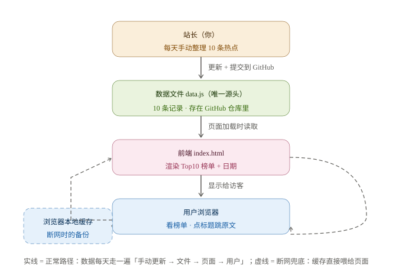

# TECH_DESIGN.md｜「今日热搜」技术设计

> 版本：v1.0 ｜ 日期：2026-09-21 ｜ 作者：WS1223334444 ｜ 依据：`PRD.md` v1.1、`research.md`

## 一、技术路线（一行版）

**前端：原生 HTML / CSS / JavaScript（无框架）｜ 数据：项目内数据文件 data.js（唯一源头）+ 浏览器本地缓存（断网备份）｜ 后端与数据库：本期无 ｜ 部署：GitHub Pages（本仓库自带，免费）**

## 二、选型理由（为什么是方案 A）

1. **与 PRD 咬合**：PRD 的功能清单（F1–F4）全部是纯前端能完成的活，没有登录、评论、实时计算——引入后端/框架等于为现成的菜雇一整个后厨。
2. **满足最狠的验收项**：PRD 要求「断网双击 index.html，10 条榜单完整显示」——纯静态方案天然满足，带构建步骤的方案（React/Vite）反而要多一层处理。
3. **零基础最稳**：不引入 npm、构建工具、组件概念，Day 7 每一行代码你都能看懂、可验证。
4. **零成本上线**：GitHub Pages 直接用现有仓库，不用注册任何新账号。

**备选方案（暂不采用）**：课程示范路线 React/Vite + CloudBase（腾讯云）。学到的主流技术栈更多、Day 23 数据库可无缝衔接，但需额外掌握构建工具链、注册腾讯云、多一层「源码→构建→页面」的心智负担。**第 23 天数据库上线时，后端部分可按此路线补入，届时已写的前端代码大部分可保留。**

## 三、项目结构（Day 7 交付形态）

```
VibeCoding/
├── index.html        # 页面骨架 + 榜单渲染逻辑（前端）
├── style.css         # 样式（若体量小可直接并入 index.html）
├── data.js           # 榜单数据文件（唯一数据源头，每日手动更新）
├── AGENTS.md / PRD.md / research.md / TECH_DESIGN.md   # 文档
└── data-flow.svg     # 数据流图
```

## 四、数据模型

数据文件内含两部分：

| 字段 | 说明 | 示例 |
|---|---|---|
| `date` | 本份榜单的日期 | `2026-09-21` |
| `items` | 热搜条目数组，恰好 10 条 | 见下 |

每条 item 的字段（与 PRD 验收标准一一对应）：

| 字段 | 说明 | 对应验收项 |
|---|---|---|
| `rank` | 排名序号 1–10 | F1 每条含排名 |
| `title` | 热搜标题 | F1 标题 / F2 点击跳转 |
| `heat` | 热度值数字 | F1 热度值 |
| `source` | 来源名称（如 微博） | F1 来源 |
| `url` | 原文链接 | F2 新标签页打开、无死链 |

## 五、数据流



**从哪来**：站长每天从各平台热搜榜人工挑选整理 10 条 → 更新 `data.js` → git 提交推送。
**到哪去**：访客打开页面 → 前端读取 `data.js` → 渲染榜单和日期 → 同时写入浏览器本地缓存 → 用户浏览、点击标题跳原文。
**断网兜底**：页面读取不到数据文件时，从本地缓存恢复上次内容（对应 PRD 验收「断网双击可用」）。

**一句话总结**：数据从「站长每天手动整理」来，经过 GitHub 上的数据文件，到「每个访客的浏览器榜单」去。

## 六、与 PRD 的对应检查

| PRD 功能 | 技术方案落点 |
|---|---|
| F1 榜单页 Top10 | index.html 读取 data.js 渲染 |
| F2 原文跳转 | 每条 item 的 url 字段 + 新标签页打开 |
| F3 手动数据 + 唯一源头 | data.js 结构化文件，字段见数据模型 |
| F4 日期 + 本地缓存 | date 字段 + 页面加载时写入浏览器本地缓存 |
| 断网可用 / 手机不横滚 | 本地缓存兜底 + CSS 自适应布局 |
